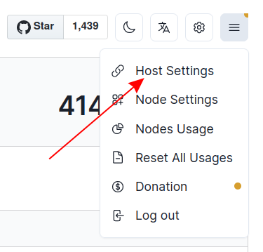
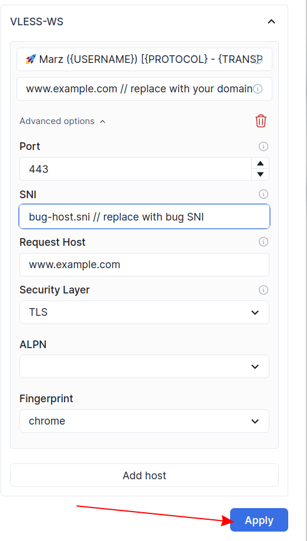

# Instructions

## Prerequisites - docker.io and docker-buildx

```bash
sudo apt-get update && sudo apt-get install -y docker.io docker-buildx
sudo usermod -aG docker $USER
```
point the domain to server ip before starting the container.

## Clone this repository to a vps

```bash
git clone https://github.com/iamtrazy/maruzibun.git
```

## Build the docker image using docker buildx


```bash
cd maruzibun
docker buildx build -t maruzibun .
```

## Run the docker image with host 443

```bash
docker run -d --restart unless-stopped \
-e DOMAIN='www.example.com' \
-e USERNAME='iamtrazy' \
-e PASSWORD='password' \
-p 443:443 \
--name maruziban maruzibun:latest
```
:warning: change your dashboard username and password after copying the command unless you want to have the above insecure credentials.
## Stop the container
```bash
docker stop maruziban
```
## Remove the container
```bash
docker rm maruziban
```
:warning: removing or stopping the container or rebooting the host will delete all the created users from marzban dashboard , use docker compose and create a volume if you want to persist users and data after reboot.

## Access panel

You can access the container using given domain in the run command with path /dashboard.  

example:- www.example.com/dashboard  

if you need to change the domain, Stop and remove the container and then re-run the docker run command.  

## Post run configuration

In order to copy from marzban dashboard you may want to configure hosts as given in below image from marzban settings menu in the top right corner of your dashboard





## CREDIT

This project is based on the "marzban" script created by the original author. You can find the original repository [here](https://github.com/Gozargah/Marzban)
